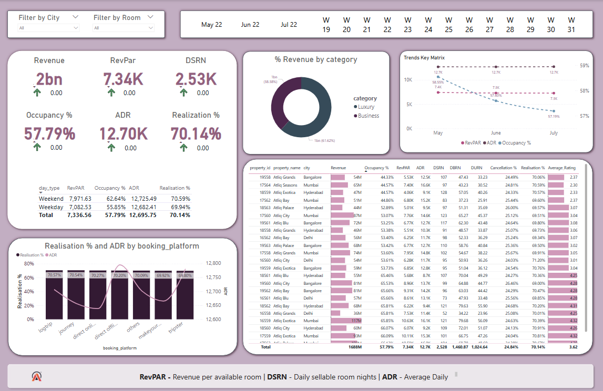
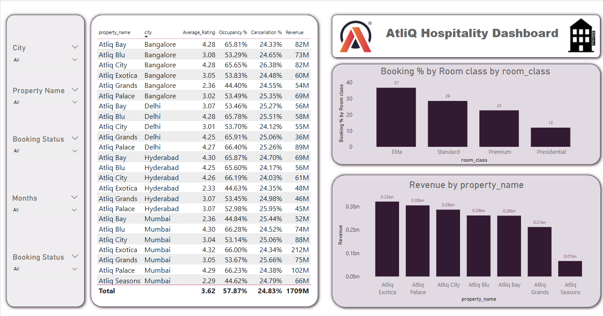
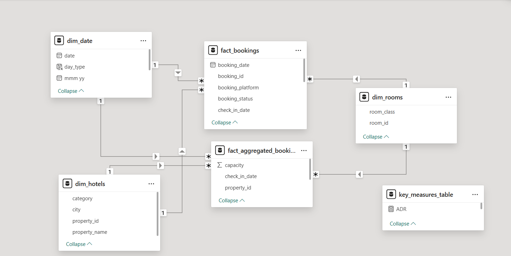

# Hospitality Revenue Analytics Dashboard

## Overview
This Power BI project provides comprehensive revenue analytics for the hospitality industry, focusing on key metrics such as RevPAR, ADR, and Occupancy rates. The dashboard offers insights into booking patterns, revenue generation, and operational efficiency of hotel properties.

## Features
- Revenue performance tracking and analysis
- Occupancy rate monitoring
- Booking platform distribution analysis
- Room class utilization metrics
- Week-over-week performance comparisons
- Cancellation and no-show rate analysis

## Dashboard





## Key Metrics and Calculations
### Revenue Metrics
```dax
Revenue = SUM(fact_bookings[revenue_realized])

ADR = DIVIDE([Revenue], [Total Bookings], 0)

RevPAR = DIVIDE([Revenue], [Total Capacity])
```

### Occupancy Metrics
```dax
Total Capacity = SUM(fact_aggregated_bookings[capacity])

Occupancy % = DIVIDE([Total Succesful Bookings], [Total Capacity], 0)
```

### Booking Performance
```dax
Total Bookings = COUNT(fact_bookings[booking_id])

Cancellation % = DIVIDE([Total cancelled bookings], [Total Bookings])

No Show rate % = DIVIDE([Total no show bookings], [Total Bookings])

Realisation % = 1- ([Cancellation %]+[No Show rate %])
```

### Daily Metrics
```dax
DBRN = DIVIDE([Total Bookings], [No of days])

DSRN = DIVIDE([Total Capacity], [No of days])

DURN = DIVIDE([Total Checked Out], [No of days])
```

## Data Model
The project uses the following main tables:
- fact_bookings
- fact_aggregated_bookings
- dim_date
- dim_rooms

## Setup Instructions
1. Clone this repository
2. Open the .pbix file using Power BI Desktop
3. Refresh the data connections if needed
4. The dashboard is ready to use

## License
This project is licensed under the MIT License - see the LICENSE.md file for details.

## Contributing
1. Fork the repository
2. Create your feature branch
3. Commit your changes
4. Push to the branch
5. Create a new Pull Request
